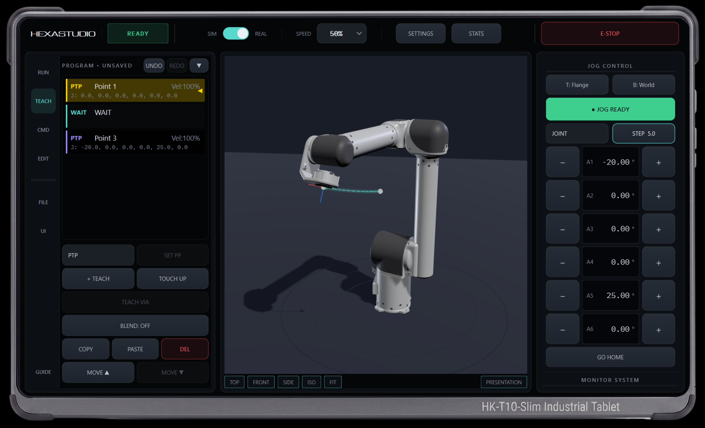
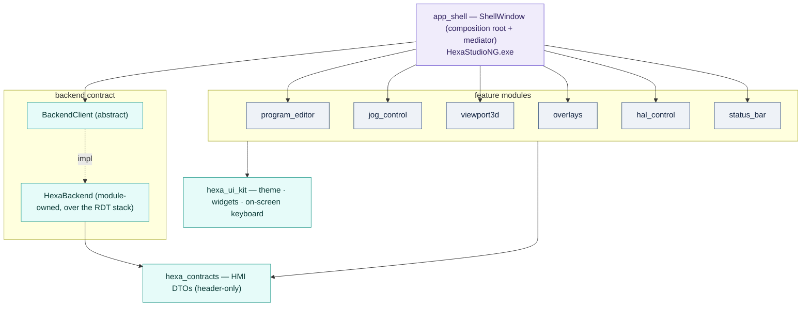
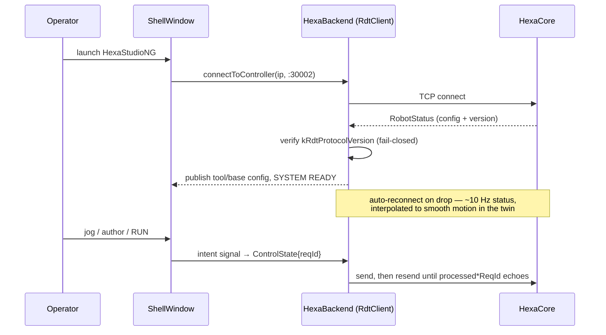

# HexaStudio — Operator Control Suite (HexaStudioNG)

**A Qt 6 teach pendant and 3D digital twin for the HexaKinetica stack: a stateless thin client that
drives the real-time controller over the RDT protocol.**

[](https://isocpp.org/)
[](https://www.qt.io/)
[](../HexaMotion-SDK)
[](#license)



HexaStudio is the operator half of the [HexaKinetica](../README.md) stack — the cockpit. It is a modern,
high-performance HMI built with **Qt 6** that connects to the [`HexaMotion`](../HexaMotion) controller. Control logic lives in the controller; the HMI holds **no authoritative state**, so it can be closed, crashed, or reconnected without affecting the robot.

This repository ships **HexaStudioNG** — the product assembled entirely from an independent module
graph over a module-owned backend. It links directly against [`HexaMotion-SDK`](../HexaMotion-SDK) for
the shared foundation (data types, RDT protocol/bridge, state, robot model). There is **no local copy**
of the SDK.


## Module graph

The HMI is assembled from independent, **bench-runnable** modules. Feature modules never depend on the
backend or on each other — they communicate only through the composition root (`app_shell`) via
intent signals and feedback slots. The one sanctioned abstraction is the backend contract.



| Module | Role |
| :--- | :--- |
| **`hexa_contracts`** | HMI DTOs (header-only) — the studio-side data contract. |
| **`hexa_backend`** | Module-owned `HexaBackend` over the RDT stack: connection, resync, program mapping. |
| **`hexa_ui_kit`** | Theme + styled widgets + on-screen keyboard (the studio's look & feel). |
| **`program_editor`** | Trajectory/program authoring with validation, undo/redo, and a RUN gate. |
| **`jog_control`** | Pendant-style jog panel (JOINT/WORLD/TOOL) with safety gating and a position monitor. |
| **`status_bar`** | Top bar: mode, speed, E-Stop, diagnostics, honest system stats. |
| **`overlays`** | Settings + diagnostics overlays (event log, subsystem annunciator). |
| **`hal_control`** | HAL commissioning / bring-up panel (homing, set-zero, per-axis jog, MKS gate). |
| **`viewport3d`** | Real-time 3D digital twin (Qt Quick 3D) + planner trajectory preview. |
| **`app_shell`** | Composition root and the **HexaStudioNG** executable. |

> UI (`hexa_ui_kit`) and DTOs (`hexa_contracts`) live **here** in Studio — they are *not* part of
> HexaMotion-SDK, which is math + I/O only. The 3D viewport loads its robot model from the SDK's shared
> `robots/` folder. See [`src/HexaStudio/MODULARIZATION.md`](src/HexaStudio/MODULARIZATION.md) for the
> full module recipe and contracts.

---

## Connection lifecycle



Each feature module's panel exposes the **same signal/slot contract** it would have against the
controller, which is why every module is runnable in isolation against an offline `Fake*Controller`
(see [Benches & screenshots](#benches--screenshots)).

---

## Build

### Prerequisites

- CMake ≥ 3.20
- **Qt 6.11** — Widgets, Quick, Qml, Quick3D
- C++20 compiler (MinGW-w64 64-bit reference toolchain)
- [`HexaMotion-SDK`](../HexaMotion-SDK) as a submodule (`external/HexaMotion-SDK`) or a sibling checkout

```bash
cmake -S . -B build -G "MinGW Makefiles" -DCMAKE_PREFIX_PATH=C:/Qt/6.11.1/mingw_64
cmake --build build -j 4 --target HexaStudioNG
```

### Run

```bash
build/bin/HexaStudioNG.exe          # add the Qt runtime + plugins to PATH
```

The HMI connects to the controller on `localhost:30002`. Useful headless flags:

| Flag | Purpose |
| :--- | :--- |
| `--selftest` | Construct-and-wire smoke of the full real-backend assembly; exits 0 without a UI loop. |
| `--probe <seconds>` | Run the full app against a live controller for N seconds, then report `CONNECTED` / `NOT CONNECTED` and exit 0/1 (CI-friendly). |
| `--screenshot <file.png>` | With `--probe`, save a window screenshot — the supported way to capture a live-connected reference image. |

---

## Benches & screenshots

Every feature module builds a standalone `*_bench` executable driven by a deterministic offline
controller, and each bench accepts `--screenshot <file.png>` to render staged reference states. This is
the reproducible way to produce documentation images without a running controller:

```bash
# assembled HMI, offline:
build/bin/app_shell_bench.exe --screenshot docs/img/shell.png
# individual panels:
build/bin/jog_control_bench.exe   --screenshot docs/img/jog.png
build/bin/status_bar_bench.exe    --screenshot docs/img/status.png
build/bin/hal_control_bench.exe   --screenshot docs/img/hal.png
build/bin/overlays_bench.exe      --screenshot docs/img/settings.png
```

Live, controller-connected capture:

```bash
build/bin/HexaStudioNG.exe --probe 5 --screenshot docs/img/hexastudio_live.png
```

> Rendered images belong in [`docs/img/`](docs/img/). Drop the generated PNGs there and embed them in
> this section — they are not committed as binaries by default.

<!-- Example once generated:

-->

---

## Requirements & design docs

Deep requirements, protocol/process specs, ADRs, and a generated per-class code reference live in the
workspace [requirements vault](../requirements) (open `requirements/` as an Obsidian vault;

## Disclaimer

The bundled robot models are for visualization and education only and are not official models of any
manufacturer. The software is provided "as is" without any guarantee of fitness for a particular
purpose.

## License

Free software under the **GNU Affero General Public License v3** — see the [LICENSE](LICENSE) file.

**Contact.** Website: <https://www.hexakinetica.com> · YouTube:
[@hexakinetica](https://www.youtube.com/@hexakinetica)
