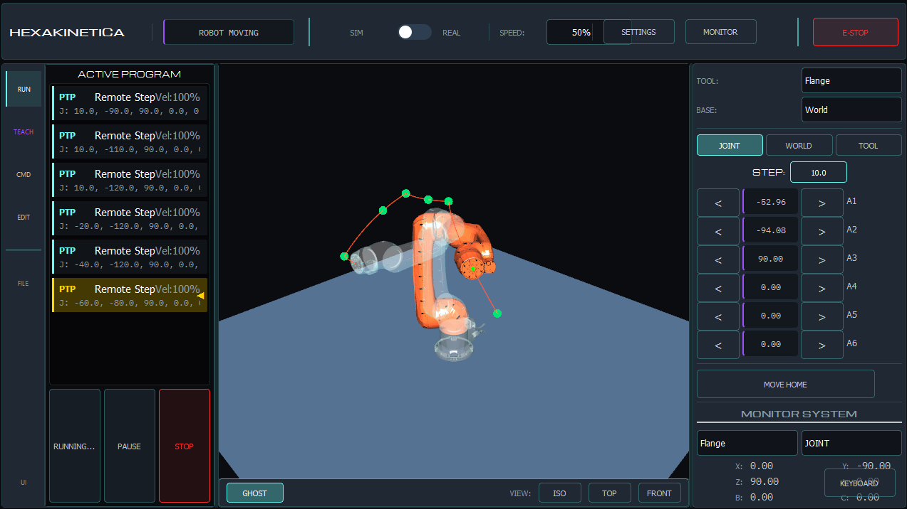

# HexaStudio Development Suite 🤖


**HexaStudio** is the next-generation control environment for the HexaKinetica ecosystem. It succeeds the legacy [RDT (Robot Development Toolkit)](https://github.com/hexakinetica/RDT-core).


[)

This repository contains the **HMI** and **VRC** components. It is designed to work with both the virtual controller (included) and the real-time hardware controller (**HexaMotion**, hosted separately).

## 🏗 Architecture

The repository is organized as a monorepo containing:

### 1. 🖥️ HexaStudio (HMI)
The "Cockpit" for the operator. A modern, high-performance GUI built with **Qt 6**.
*   **Easy Programming:** Trajectory editor for robot logic.
*   **3D Digital Twin:** Real-time visualization using Qt3D.
*   **Stateless Design:** Acts as a thin client; logic resides in the controller (Virtual or Real).

### 2. 🧠 HexaVRC (Virtual Robot Controller)
A lightweight standalone emulator of the robot controller logic.
*   **Physics Simulation:** Simulates kinematics and interpolation loops (50Hz).
*   **Hardware Abstraction:** Implements the RDT protocol stack for development without physical hardware.
*   **Safe Playground:** Allows testing programs without the real robot.

### 3. 🔗 Shared
Common protocol definitions (**RDT Protocol**) ensuring binary compatibility between:
*   HexaStudio (This Repo)
*   HexaVRC (This Repo)
*   RDT-Next (External Hardware Repo)

---

## 🚀 Getting Started

### Prerequisites
*   CMake 3.16+
*   Qt 6.10 (Widgets, 3D modules)
*   C++20 compliant compiler (MSVC 2019+, GCC 10+, Clang 10+)

### Build
```bash
mkdir build && cd build
cmake ..
cmake --build .
```

### 🧩 Related Projects

- More robotics content on our [YouTube channel](https://www.youtube.com/@hexakinetica)

### Contact

Email: contact@hexakinetica.com
Website: https://www.hexakinetica.com

### Disclaimer

The robot models included are for visualization and educational purposes only and are not official models from their respective manufacturers. They are not intended for manufacturing, engineering, or commercial use. All trademarks, product names, and company names mentioned are the property of their respective owners.

The software is provided "as is" without any guarantee of accuracy, completeness, or fitness for any particular purpose.
If you are the copyright holder or believe any material posted violates your rights, please contact us to request removal.

### Open Source License (GPL v3)
This project is free software: you can redistribute it and/or modify it under the terms of the **GNU General Public License as published by the Free Software Foundation**, either version 3 of the License.

**What this means:**
*   ✅ You can use this software for personal projects, education, and research.
*   ✅ You can modify the code and distribute it.
*   ⚠️ **Condition:** If you distribute this software (or a modified version of it), you **must open-source your code** under the same GPL v3 license.

See the [LICENSE](LICENSE) file for the full text.
